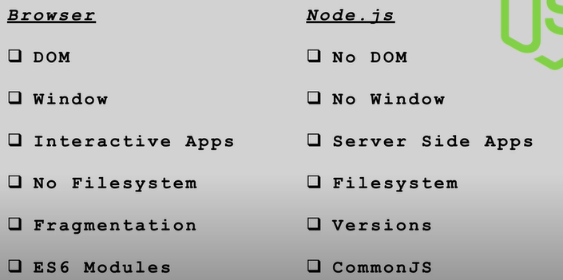

# Why Node.js?

## What is Node.js?
- It is an environment to run JavaScript outside the browser.
- Built on Chrome's V8 JavaScript engine.
- V8 is the name of the JavaScript engine that powers Google Chrome. It's the thing that takes our JavaScript and executes it while browsing with Chrome. V8 is the JavaScript engine, i.e., it parses and executes JavaScript code.

## Things to be familiar with prior:
- HTML
- CSS
- JavaScript fundamentals
- ES6
- Callback functions
- Async/Await
- Promises

## Browser vs Server:

[why no dom in node.js](https://stackoverflow.com/questions/6657216/why-doesnt-node-js-have-a-native-dom#:~:text=Javascript%20as%20a%20language%20is,Hence%20no%20DOM.&text=Node%20is%20a%20runtime%20environment,a%20DOM%20like%20a%20browser.)

## Node.js Features:
- __dirname - path to the current directory

- __filename - file name

- require - function to use modules (CommonJS)

- module - info about current module (file)

- process - info about env where the program is being executed

## modules:
- to access things from a module, we need to export them from the module and import them in the file where we want to use them.

- this is done using the `module.exports` and `require` functions.

- `module.exports` is an object that will hold all the things that we want to export from a module.

- `require` is a function that we use to import things from a module.

- `module.exports` and `require` are part of the CommonJS module system.

- Every file in Node.js is a module.

- Modules are encapsulated and only share minimum details.

- refer 1.js and 2.js for example.

## built-in modules:

- fs - file system module
- http - http module
- os - os module
- path - path module
- util - util module
- v8 - v8 module

## sync vs async:

- synchronous - blocking
- asynchronous - non-blocking (better) using callbacks, promises, async/await refer 6-fs-async.js

## npm:

- npm is the world's largest software registry.

- node package manager

- npm i packageName     //for local

- npm install -g packageName     //for global

- package.json - manifest file (stores im info abt project/package) it is created after running npm init [for more info abt package.json](https://nodesource.com/blog/the-basics-of-package-json/)

- manual approach (create package.json in the root, create properties etc)

- npm init (step by step , press enter to skip)

- npm init -y  (everything default)

- node_modules folder stores all the dependencies

- npm install : is used to install dependencies that are listed in the package.json file.

## gitignore:

- .gitignore file is used to specify files and directories that should be ignored by git.

## nodemon:

- nodemon is a tool that helps develop node.js based applications by automatically restarting the node application when file changes in the directory are detected.

- npm install -g nodemon (globally)

- npm i nodemon -D (locally)

- npm i nodemon --save-dev (locally)

- nodemon app.js (instead of node app.js)

## scripts property in package.json:

- scripts property is used to define scripts that can be run using npm.

- Example : "start": "node app.js" so now we can run `npm start` instead of `node app.js`

- npm scriptName vs npm run scriptName : npm scriptName can be used if the scriptName is recognized by npm such as start, test, etc. If the scriptName is not recognized by npm, then we have to use npm run scriptName.

## uninstalling a package:

- npm uninstall packageName

## package-lock.json:

- package-lock.json is automatically generated for any operations where npm modifies either the node_modules tree, or package.json.

- It describes the exact tree that was generated, such that subsequent installs are able to generate identical trees, regardless of intermediate dependency updates.

## To check whether a package is installed globally or locally:

- npm list -g packageName (for global)

- npm list packageName (for local)

 ## Event Loop:

 - [Event Loop](https://nodejs.org/en/docs/guides/event-loop-timers-and-nexttick/)

- refer chatGpt

- event loop is responsible for executing the code, collecting and processing events, and executing queued sub-tasks.

- offloading means to send a task to another device or system to be processed.

- Node.js offloads the I/O operations to the OS kernel.

- Node.js is single-threaded and event-driven.

- async operations are offloaded to the OS kernel. such as file system operations, network operations, settimeout, etc.

- after completion of the sync code, the event loop will check the event queue for any async code to be executed.

## promises:

- A promise is an object representing the eventual completion or failure of an asynchronous operation.

- A promise is in one of these states:
  - pending: initial state, neither fulfilled nor rejected.
  - fulfilled: meaning that the operation completed successfully.
  - rejected: meaning that the operation failed.

- A promise is settled if it’s not pending (it has been resolved or rejected).
